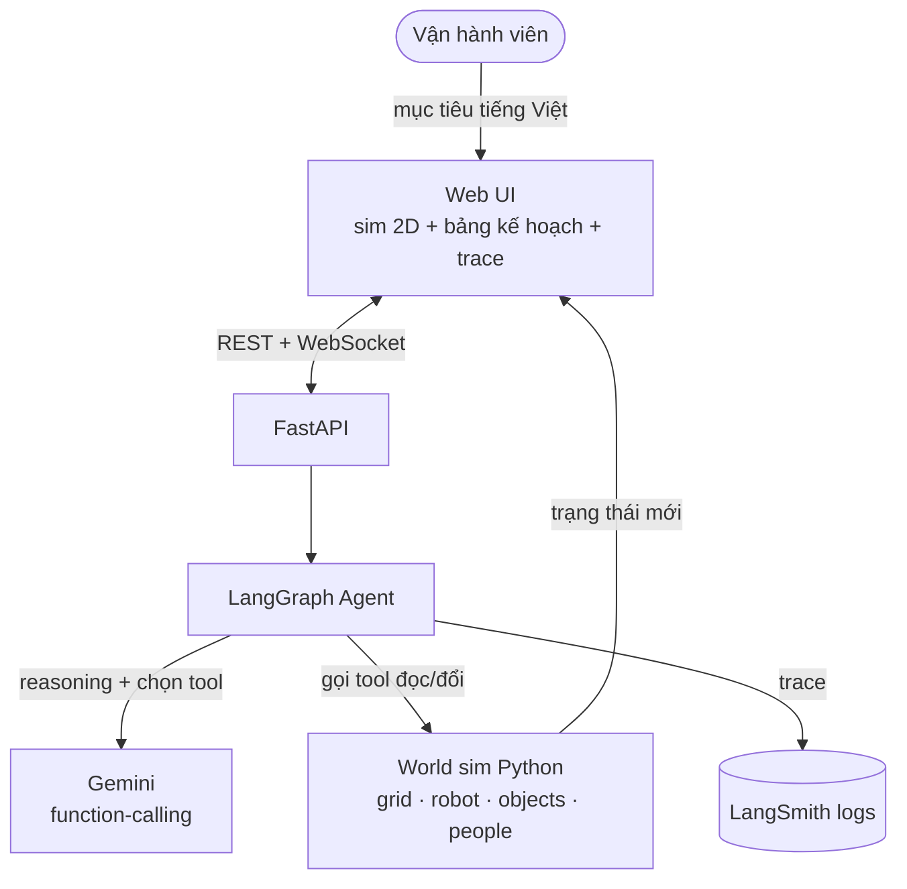
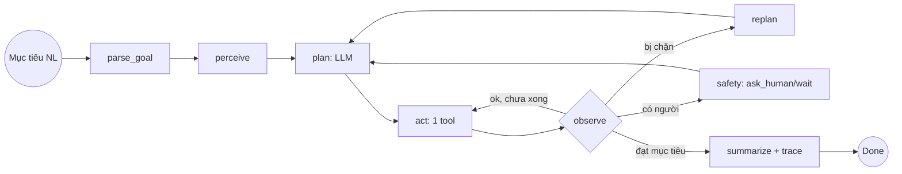
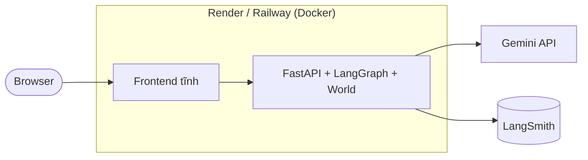

# Architecture Document — AI20K‑162 Task‑Planner Agent

## System Overview

Một **agent lập kế hoạch** nhận mục tiêu tiếng Việt, phân rã thành chuỗi hành động và thực thi trong một **kho mô phỏng 2D** bằng cách gọi tool, **quan sát kết quả thật từ sim** và **lập lại kế hoạch (replan)** khi gặp người/vật cản. Lõi agent là **LangGraph** (plan‑and‑execute + ReAct), bộ não là **Gemini** (function‑calling). Sim "có thẩm quyền" nằm ở backend (Python) để logic testable; frontend chỉ render trạng thái + trace qua WebSocket.

## Architecture Diagram

## Components

### 1. Frontend (Web canvas 2D)
- **Purpose:** nhập mục tiêu; render kho 2D + robot + người/vật cản; hiển thị **kế hoạch & trace** (suy nghĩ → tool → observation).
- **Key Features:** kịch bản mẫu, badge DỪNG/HỎI khi gặp người, responsive + dark mode; (stretch) nhập mục tiêu bằng **giọng nói tiếng Việt** (Web Speech API).
- **State:** nhận từ backend qua WebSocket (không giữ logic sim ở client).

### 2. Backend (FastAPI)
- **Purpose:** nhận mục tiêu, chạy agent, stream trace + trạng thái world.
- **API:** `GET /health`, `POST /api/v1/run`, `WS /api/v1/ws`.
- **Authentication:** không (demo); production siết origin + rate‑limit.

### 3. AI Agent (LangGraph)
- **Agent Type:** **Plan‑and‑Execute + ReAct hybrid** (lập kế hoạch trước, thực thi từng bước, quan sát, replan).
- **State:** `goal_text, goal, plan, history, world_view, status, replans, steps, answer, pending_question`.
- **Nodes:** `parse_goal · perceive · plan · act · observe · replan · ask_human · summarize`.
- **Tools:** perceive / locate_object / check_path / move_to / pick / drop / wait / ask_human / done.
- **Flow:**

### 4. Sim World (`services/world.py`)
- **Type:** grid 2D (vd 16×10). Thực thể: robot (vị trí, vật đang mang), objects (pallet/thùng có nhãn), zones (khu A, chuyền 3, lối thoát hiểm), obstacles tĩnh, people động.
- **Dynamics:** `move_to` dùng A*/BFS; ô kế bị chiếm → trả `blocked_by` (kích hoạt replan); người sát robot → buộc dừng/hỏi.
- **Tables/Persistence:** trạng thái trong RAM theo phiên (không cần DB). Kịch bản nạp từ JSON.

### 5. Vector Store
- **Type:** **không có (N/A)** ở v1 — đây là agent **planning + tool‑use**, không phải RAG. (Có thể thêm RAG "thư viện kỹ năng/quy trình" ở bản sau.)

## Data Flow

1. Người dùng nhập mục tiêu tiếng Việt → `POST /api/v1/run`.
2. `parse_goal` → cấu trúc {target, destination, constraints}.
3. `perceive` đọc world → `plan` (Gemini sinh chuỗi hành động grounded).
4. `act` gọi 1 tool → `World` thay đổi → `observe` đọc kết quả thật.
5. Bị chặn → `replan`; gặp người → `ask_human/wait`; đạt mục tiêu → `summarize`.
6. Mỗi bước stream qua `WS /ws` → frontend render robot + trace.

## Deployment Architecture

## Security

- `GEMINI_API_KEY` ở `.env` / biến môi trường server — **không commit**.
- Tool **chỉ thao tác World nội bộ** (không gọi hệ thống thật) → an toàn để demo.
- Input validate bằng Pydantic; giới hạn số bước/replan chống vòng lặp vô hạn.

## DevOps, Logging & Quality Gates

- **CI/CD:** `.github/workflows/ci.yml` chạy **ruff + pytest + docker build** mỗi push (main/develop) và PR → giữ nhánh luôn xanh. *(Cohort 1: 0/12 đội có CI — đây là điểm vượt mặt.)*
- **AI Logs (deliverable #4):** **LangSmith** (`LANGCHAIN_TRACING_V2`) log prompt + tool calls; thêm hook `AI_LOG_*` (BTC cấp) ghi `.ai-log/`.
- **Container:** `Dockerfile` (python 3.11‑slim, multi‑stage) + `docker-compose.yml`; `HEALTHCHECK` gọi `/health`.
- **Config & secrets:** `pydantic-settings` đọc `.env`; `.env` trong `.gitignore`; `.env.example` chỉ là template (không chứa key cá nhân).
- **Tests:** pytest cho `world` / `tools` / `graph` / `eval`, giữ xanh ở mọi PR (**72 test**).

## Design Decisions

| Decision | Choice | Reason |
|----------|--------|--------|
| Kiểu agent | Plan‑and‑Execute + ReAct | Lập kế hoạch tường minh + sửa khi lệch → minh bạch, hợp đề tài 162 |
| Orchestration | LangGraph | State machine rõ ràng, dễ thêm node replan/safety, testable |
| LLM | Gemini function‑calling | Free tier, hỗ trợ tool‑calling, tiếng Việt tốt |
| Sim ở backend | Python `World` | Logic testable (pytest), tool đọc observation thật (chống hallucinate) |
| DB | Không (RAM/JSON) | v1 không cần lưu bền; giảm phụ thuộc |
| Frontend | Canvas thuần | Nhẹ, render sim + trace, dễ responsive/dark |
| Người (people) | Vật cản **động**: `move_to` đi từng ô, dừng khi ô kế có người | Kích hoạt đúng vòng dừng/hỏi/replan; tránh để A* "lặng lẽ" vòng tránh người (sẽ không còn gì để replan) |
