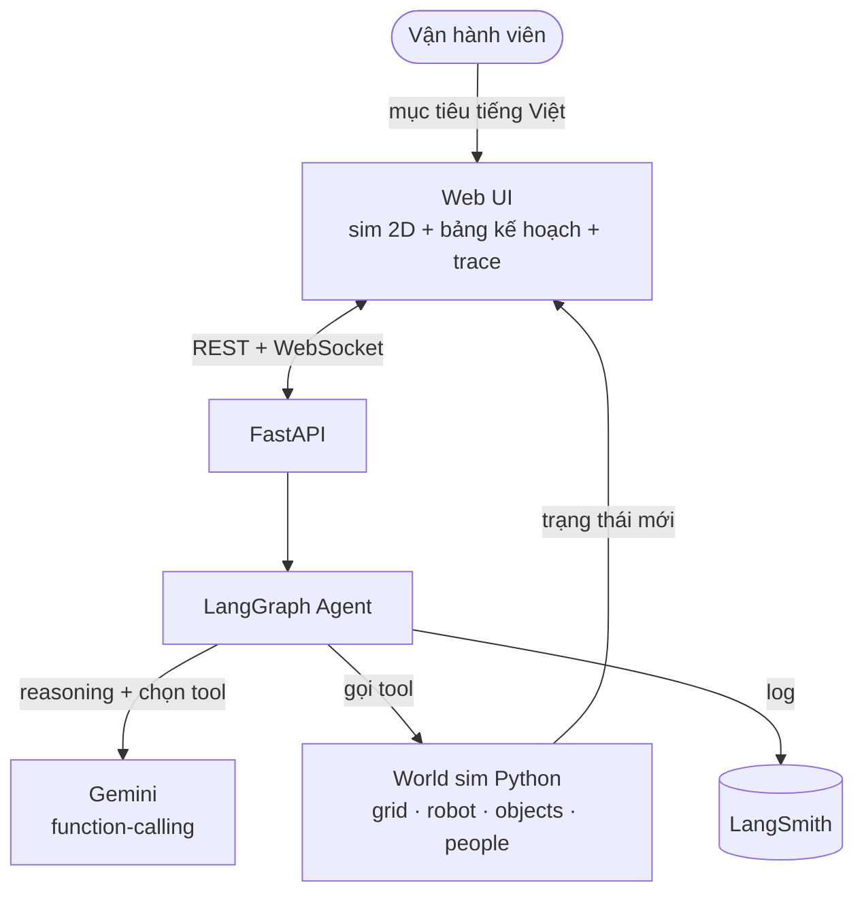
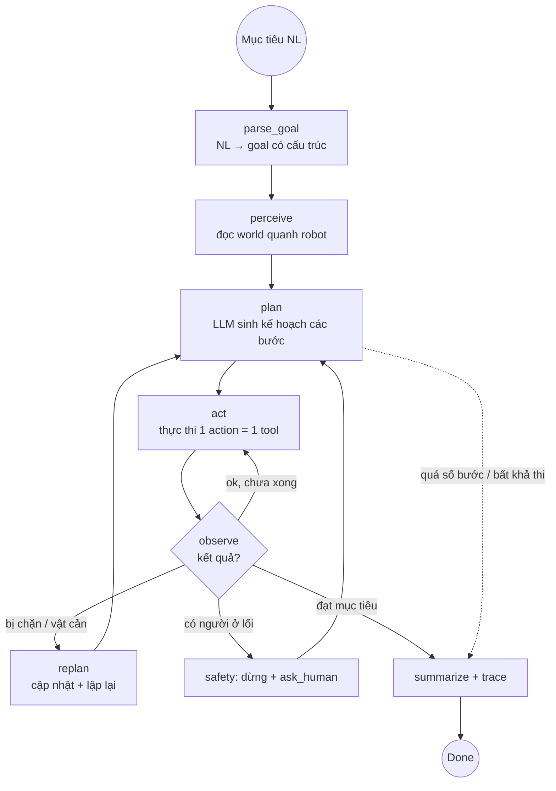

# AI20K‑162 — Agent Lập kế hoạch tác vụ điều khiển robot kho bằng ngôn ngữ tự nhiên
### Scoping · Kiến trúc Agent (LangGraph) · Tool list · Plan cho Claude Code

> **Một câu:** Vận hành viên ra **mục tiêu bằng tiếng Việt** → **agent (LLM) lập kế hoạch nhiều bước, thực thi trong kho mô phỏng 2D bằng tool, và tự điều chỉnh (replan) khi gặp người/vật cản** — minh bạch, có người trong vòng lặp.
>
> **Đề tài:** AI20K‑162 (Lập kế hoạch tác vụ) **gộp** AI20K‑161 (Điều khiển bằng ngôn ngữ tự nhiên).
> **Ràng buộc:** chỉ **laptop + điện thoại**, ~2 tuần, **không phần cứng robot** → robot là **mô phỏng 2D**, agent là **thật**.

---

## 1. Vì sao đề tài này hợp

- **Là agent đúng nghĩa:** lập kế hoạch = năng lực lõi của agent; có vòng **reason → act → observe → replan** + gọi tool. Đây là thứ rubric BTC cho điểm cao, **không phải ép**.
- **Demo trọn trên laptop:** thế giới mô phỏng trong trình duyệt, không cần robot.
- **Tái dùng thế mạnh đội:** perception cũ (detect/open‑vocab) trở thành **tool tri giác** của agent; văn hoá **minh bạch & eval** mang nguyên sang.
- **Hợp template BTC:** scaffold `src/` (LangGraph `graph.py`/`state.py`/`nodes/`/`tools/` + FastAPI) **sinh ra để chứa đúng dự án này**.

## 2. User & 2–3 pain point giải quyết

| # | User | Pain | Agent giải |
|---|------|------|-----------|
| 1 | Vận hành viên (không phải kỹ sư) | Phải lập trình từng bước / không ra lệnh cho robot được | **Ra lệnh tiếng Việt tự nhiên** → agent hiểu & thực thi (161) |
| 2 | Quản lý vận hành | Môi trường đổi (người/vật cản xuất hiện) → phải lập trình lại tay | Agent **tự lập kế hoạch nhiều bước + replan** khi bị chặn (162) |
| 3 | An toàn/đảm bảo chất lượng | "Hộp đen" — không biết robot định làm gì, có an toàn không | **Minh bạch**: hiện kế hoạch + trace lý luận; gặp người → **dừng/hỏi** (human‑in‑loop) |

## 3. Phạm vi (narrow)

**IN (v1):** mục tiêu dạng text tiếng Việt · kho mô phỏng 2D (1 robot) · tool tri giác + hành động · vòng plan→act→observe→replan · an toàn dừng/hỏi khi có người · trace minh bạch · bộ eval đo tỉ lệ thành công.
**OUT (v1):** robot thật, 3D, đa robot (đó là 171/183), RL/học, camera thật (mặc định sim).
**Stretch (nếu dư thời gian):** (a) **voice tiếng Việt** (Web Speech API) cho mục tiêu; (b) **perception thật**: nạp 1 ảnh kho → chạy OWL‑ViT (code cũ) → sinh world state (bridge dự án CV cũ).

## 4. Kiến trúc tổng thể



- **Sim "có thẩm quyền" nằm ở backend (Python `World`)** → testable, agent tool thao tác trực tiếp; frontend chỉ **render** trạng thái qua WebSocket. (Rubric thích logic testable.)

## 5. Vòng lặp agent (LangGraph)



Đây là **plan‑and‑execute + ReAct hybrid**: lập kế hoạch trước, thực thi từng bước, quan sát, **replan** khi lệch. Có **giới hạn vòng lặp** (max steps/replans) để không treo.

## 6. State schema (LangGraph state)

```python
class AgentState(TypedDict):
    goal_text: str                 # mục tiêu NL gốc
    goal: dict | None              # {target, destination, constraints[]}  (parse_goal)
    plan: list[str]                # các bước dự kiến (mô tả)
    history: list[dict]            # [{action, args, observation, ok}]
    world_view: dict               # perceive() gần nhất: objects/people/obstacles + robot pos
    status: str                    # planning | acting | replanning | asking | done | failed
    replans: int                   # đếm số lần replan (cap)
    steps: int                     # đếm số action (cap)
    answer: str                    # tóm tắt cuối + trace
    pending_question: str | None   # khi ask_human
```

## 7. Tool list (primitives agent gọi)

**Tri giác (đọc world — "mắt" của agent):**
| Tool | Input | Output | Ghi chú |
|------|-------|--------|--------|
| `perceive()` | — | objects/people/obstacles quanh robot + vị trí robot | ground‑truth từ sim (v1); stretch: từ OWL‑ViT ảnh thật |
| `locate_object(label)` | nhãn vật (pallet/thùng/xe nâng) | toạ độ + zone (trái/phải, gần/xa) | open‑vocab grounding analog |
| `check_path(target)` | đích | `{clear, blocker?}` | người/vật cản trên đường? |

**Hành động (đổi world):**
| Tool | Input | Output |
|------|-------|--------|
| `move_to(target)` | object/zone | `{reached, blocked_by?}` (đi từng ô, dừng nếu chắn) |
| `pick(object)` | object gần robot | `{ok, error?}` |
| `drop(at)` | zone/đích | `{ok, error?}` |

**Meta / an toàn:**
| Tool | Input | Output |
|------|-------|--------|
| `wait(ticks)` | số tick | quan sát lại (người có thể đã đi) |
| `ask_human(question)` | câu hỏi | tạm dừng, chờ người trả lời (human‑in‑loop) |
| `done(summary)` | tóm tắt | kết thúc tác vụ |

> Tools khai báo cho Gemini bằng **function‑calling schema** (tên + mô tả + JSON params). Agent **không** được "tưởng tượng" kết quả — phải gọi tool và đọc observation thật từ sim (chống hallucinate, đúng tinh thần grounding của đội).

## 8. Sim world spec

- **Grid 2D** (vd 16×10 ô). Thực thể: `robot` (vị trí, đang‑mang‑gì), `objects` (pallet/thùng… có nhãn + vị trí), `zones` (khu A, chuyền 3, lối thoát hiểm), `obstacles` tĩnh, `people` (động — có thể spawn/di chuyển giữa chừng để kích hoạt replan).
- **Động học:** `move_to` chạy A*/BFS tới đích; nếu ô kế tiếp bị người/vật cản chiếm → trả `blocked_by` (kích hoạt replan). `people` di chuyển theo kịch bản đơn giản để demo replan.
- **An toàn:** nếu người nằm trong **bán kính cạnh robot** → buộc `wait`/`ask_human`, không đi xuyên.
- **Kịch bản nạp sẵn** (cho demo & eval): vài bản đồ + mục tiêu mẫu (JSON).

## 9. An toàn & minh bạch (giữ văn hoá "Thật vs Mô phỏng")

- **Nhãn rõ:** "Thế giới 2D mô phỏng — agent (LLM + planning) là thật". Không nói đây là robot thật.
- **Trace hiển thị:** mỗi bước show *suy nghĩ → tool gọi → observation*; người dùng kiểm chứng được.
- **Human‑in‑loop:** gặp người/bất định → dừng + hỏi, không tự ý.
- **Giới hạn:** cap số bước/replan; vạch rõ "đây là planner mức nhiệm vụ, chưa thay lớp điều khiển/an toàn cứng của robot thật".

## 10. Đánh giá (Evaluation — thế mạnh đội)

- **Bộ task** (vd 15–20 kịch bản: bản đồ + mục tiêu + lời giải mong đợi).
- **Metrics tự động (pytest):** `success_rate` (đạt mục tiêu), `safety_violations` (đi xuyên người — phải = 0), `avg_steps`, `replan_count`, `invalid_tool_calls`.
- **So sánh:** agent‑có‑replan vs baseline‑không‑replan (ablation) → minh hoạ giá trị của vòng observe→replan.
- Xuất `eval/results/report.md` (đúng deliverable #10).

## 11. Tech stack & map vào template `src/`

| Lớp | Công nghệ | File trong template |
|-----|-----------|---------------------|
| Agent | LangGraph + LangChain | `src/agents/graph.py`, `src/agents/state.py` |
| Nodes | parse_goal / perceive / plan / act / observe / replan / summarize | `src/agents/nodes/*.py` |
| Tools | perceive/locate/check_path/move/pick/drop/wait/ask/done | `src/agents/tools/*.py` |
| LLM | Gemini (`langchain-google-genai`, function‑calling) | `src/services/llm.py` |
| Sim | `World` class (grid, entities, A*) | `src/services/world.py` (mới) |
| API | FastAPI: `POST /api/v1/run` (mục tiêu→chạy), `WS /ws` (stream trace+world) | `src/api/routes.py`, `src/main.py` |
| Schemas | Pydantic (Goal, Action, WorldState, StepTrace) | `src/models/schemas.py` |
| Frontend | Canvas 2D render + ô nhập mục tiêu + bảng trace (responsive, dark) | `frontend/` hoặc `src/static/` |
| Tests | pytest (tools, world, graph, eval) | `tests/` |
| DevOps | Docker + GitHub Actions (đã có) + LangSmith logs | `Dockerfile`, `.github/`, `.env` |

## 12. Kế hoạch 2 tuần (theo phase)

**Phase 0 — Sim world + render (Ngày 1–2).** `World` (grid/entities/A*) + `WorldState` schema + FastAPI trả state + frontend canvas render robot/objects/people. *DoD:* mở web thấy kho 2D, robot đứng yên, nạp được bản đồ mẫu.

**Phase 1 — Tools + thực thi 1 bước (Ngày 3–4).** Hiện thực 9 tool thao tác `World`; test pytest từng tool. *DoD:* gọi `move_to`/`pick`/`drop` qua API thấy robot di chuyển; tool có unit test.

**Phase 2 — Agent plan loop (Ngày 5–7).** LangGraph: parse_goal → perceive → plan(LLM function‑calling) → act → observe → done. Gemini chọn tool. Stream trace ra UI. *DoD:* mục tiêu đơn giản ("đưa pallet A tới chuyền 3", không vật cản) → agent tự hoàn thành, hiện kế hoạch + trace.

**Phase 3 — Replan + an toàn (Ngày 8–9).** Spawn người/vật cản giữa chừng → `blocked_by` → node replan; người sát robot → `ask_human`/`wait`. Cap steps/replans. *DoD:* giữa đường chắn lối → agent đổi kế hoạch tới đích; gặp người → dừng/hỏi, 0 lần đi xuyên.

**Phase 4 — UI/UX + trace đẹp (Ngày 10–11).** Responsive + dark mode; bảng *suy nghĩ→tool→observation*; nút kịch bản mẫu; (stretch) voice tiếng Việt. *DoD:* demo mượt trên laptop + điện thoại.

**Phase 5 — Eval + deploy + tài liệu (Ngày 12–14).** Bộ task + pytest metrics + ablation; Docker/CI xanh; deploy (Render/Railway backend); điền README/ARCHITECTURE/eval/JOURNAL/WORKLOG; quay video + pitch. *DoD:* 10 deliverables đủ; chạy trọn demo 3 phút 3 lần không lỗi.

## 13. Demo 3 phút

1. Gõ tiếng Việt: *"Đưa pallet linh kiện A từ khu A sang chuyền 3, tránh người."*
2. Agent **perceive** → **hiện kế hoạch** (các bước) → robot ảo đi.
3. Giữa đường **spawn 1 người** chắn lối → badge **DỪNG/HỎI** → agent **replan** đổi đường.
4. Tới nơi → **drop** → **tóm tắt + trace** (suy nghĩ + tool calls).
5. Mở **bảng eval** (success rate, 0 safety violation) + nhãn "thế giới mô phỏng, agent thật".

## 14. Map 10 deliverables BTC

| # | Deliverable | Ở đâu |
|---|-------------|-------|
| 1 Source | `src/` (agent + world + api) | ✅ trọng tâm |
| 2 README | mô tả NL→plan→act | cập nhật |
| 3 Architecture | mục 4–5 (Mermaid) | `docs/architecture_diagram.md` |
| 4 AI Logs | LangSmith + hooks | cấu hình |
| 5 Live URL | deploy FastAPI + static FE | Render/Railway |
| 6 Video | kịch bản mục 13 | quay |
| 7 Pitch | 10 slide | `presentation/` |
| 8 Journal | nhật ký 2 tuần | `JOURNAL.md` |
| 9 Worklog | theo ngày | `WORKLOG.md` |
| 10 Eval | mục 10 | `eval/results/report.md` |

## 15. Prompt gợi ý cho Claude Code

```
Đọc PLAN_agent_taskplanner.md trong repo. Xây Agent lập kế hoạch tác vụ (AI20K-162+161)
theo template src/ (LangGraph + FastAPI + Gemini function-calling) + sim 2D ở backend.

Làm theo PHASE, dừng sau mỗi phase để mình duyệt:
- Phase 0: src/services/world.py (grid/entities/A*) + schemas + GET state + frontend canvas render.
- Phase 1: 9 tools trong src/agents/tools/ thao tác World + pytest từng tool.
- Phase 2: LangGraph graph.py + nodes (parse_goal/perceive/plan/act/observe/summarize),
  Gemini function-calling chọn tool; stream trace qua WebSocket.
- Phase 3: node replan + an toàn (ask_human/wait khi có người) + cap steps/replans.
- Phase 4: UI responsive + dark + bảng trace; (stretch) voice tiếng Việt.
- Phase 5: bộ eval + pytest metrics + ablation; Docker/CI; điền 6 form deliverable.

RÀNG BUỘC: tool PHẢI đọc observation thật từ World (cấm hallucinate kết quả); có giới hạn
vòng lặp; type hints + pytest + ruff pass; .env giữ GEMINI_API_KEY (không commit); LangSmith bật.
Mỗi phase xong: liệt kê đã làm + test gì, rồi dừng.
```

---

> **Lưu ý:** các form trong repo (`README.md`, `ARCHITECTURE.md`, `docs/architecture_diagram.md`, `eval/results/report.md`, `JOURNAL.md`, `WORKLOG.md`) hiện đang mô tả **dự án CV cũ** → cần viết lại cho dự án agent này. Mình có thể cập nhật toàn bộ 6 form khi bạn duyệt xong scoping.
