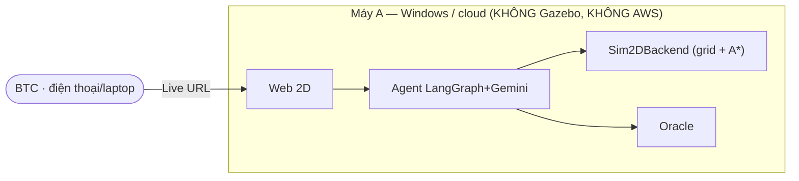

# Kế hoạch — MÁY A: Web Sim 2D (Live cho BTC)

> **Phần của Hybrid demo.** File đôi: xem **`PLAN_may_B_gazebo.md`** cho Máy B.
> **Máy A = máy hiện tại (Windows).** Vai trò: **bản demo LIVE tương tác** + nơi nhập mục tiêu.

---

## ⚠️ Làm rõ quan trọng (đọc trước)

**Máy A KHÔNG chạy Gazebo. Máy A KHÔNG chạy AWS warehouse world. KHÔNG ROS. KHÔNG GPU.**

- AWS `small_warehouse_world` là **asset của Gazebo** → chỉ chạy được trên **Máy B** (Linux + Gazebo).
- Máy A chỉ chạy **web sim 2D bằng Python thuần** — đây là lý do nó nhẹ, deploy được lên cloud, và BTC bấm thử ngay trên laptop/điện thoại.
- Máy A **chỉ dùng scenario JSON 2D** của dự án (`eval/scenarios/m*.json`, `t*.json`) — **không** liên quan dataset AWS.

> Nói gọn: *muốn dùng AWS/Gazebo thì việc đó nằm hết ở Máy B; Máy A không đụng tới.*

---

## 1. Máy A chạy gì

| Thành phần | Mô tả |
|---|---|
| FastAPI | `POST /api/v1/run`, `WS /api/v1/ws`, `GET /health` |
| Agent | LangGraph + Gemini (parse→perceive→plan→act→observe→replan→summarize) |
| Backend thế giới | **`Sim2DBackend`** (grid 2D + A* + invariants) |
| Oracle | `check_object_moved` (chấm độc lập) |
| Frontend | Canvas 2D + ô nhập mục tiêu tiếng Việt + bảng trace |
| **Cờ** | **`WORLD_BACKEND=sim2d`** |

Không có ROS, không có Gazebo, không có rclpy. Chỉ Python 3.11 + web.

---

## 2. Môi trường & cách chạy

```bash
# Windows (hoặc deploy cloud)
python3.11 -m venv .venv
.venv\Scripts\activate          # Windows
pip install -r requirements.txt

cp .env.example .env            # đặt GEMINI_API_KEY
# (KHÔNG cần biến nào liên quan ROS/Gazebo)

uvicorn src.main:app --reload --port 8000
# Swagger: http://localhost:8000/docs  · Frontend: mở trang web 2D
```

**Deploy (để có Live URL):** Render/Railway theo `DEPLOY.md` — chỉ là app Python, deploy thẳng, không cần máy đặc biệt.

---

## 3. Việc cần làm (Máy A)

1. **Tách interface `WorldBackend`** (Protocol) khớp các tool: `perceive / locate / check_path / move_to / pick / drop / snapshot / state_for_oracle`.
2. **Gói `World` 2D hiện tại** thành `Sim2DBackend(WorldBackend)` — refactor **không đổi hành vi** → **toàn bộ test cũ phải vẫn xanh**.
3. **Cờ config** `WORLD_BACKEND=sim2d|gazebo`; `get_current_world()` trả backend theo cờ (mặc định `sim2d`).
4. **Deploy web 2D** → lấy **Live URL** (deliverable).
5. **Polish frontend** cho demo: badge **DỪNG/HỎI** khi gặp người, dark mode, vài kịch bản mẫu, nút chạy lại.

> Refactor ở (1)(2) chính là cái "khóa ranh giới hoán đổi" để Máy B cắm `GazeboBackend` sau này **mà không sửa agent**.

---

## 4. Vai trò trong buổi demo

- Là **kênh LIVE chính** (0:30–1:30 trong kịch bản 3 phút): BTC nhập mục tiêu tiếng Việt → agent lập kế hoạch → di chuyển → drop đúng ô → **oracle xác nhận** + trace hiện rõ.
- **BTC tự thử trên điện thoại** qua Live URL.
- **Độc lập với Máy B khi chạy live** — nếu Máy B/Gazebo có trục trặc, phần live của Máy A vẫn chạy bình thường.



---

## 5. Liên hệ với Máy B

- Máy A và Máy B **dùng chung một repo / một agent code**; khác nhau chỉ ở **cờ `WORLD_BACKEND`**.
- Đây là điểm thuyết phục BTC: *cùng agent, chỉ đổi backend* → bằng chứng cho đường **sim→real**.
- Khi demo: Máy A cho phần **2D live**; Máy B cho phần **Gazebo (video/stream)** với **cùng mục tiêu, trace giống hệt**.

---

## 6. Timeline phần Máy A

- **D1–2:** refactor `WorldBackend` + `Sim2DBackend` (giữ test xanh); bật cờ config.
- **D2:** deploy web 2D → **Live URL**.
- **D3–7:** polish frontend (trace, badge, kịch bản mẫu), bảo đảm demo live mượt.
- **Tuần 2 (D12):** quay đoạn 2D cho video 3 phút; tổng duyệt.

---

## 7. Checklist Máy A

- [ ] `WorldBackend` + `Sim2DBackend` xong, test cũ vẫn xanh
- [ ] Cờ `WORLD_BACKEND` hoạt động (mặc định `sim2d`)
- [ ] Deploy thành công → có Live URL công khai
- [ ] Frontend: nhập tiếng Việt, canvas, trace, badge dừng/hỏi
- [ ] Demo live chạy ổn trên điện thoại
