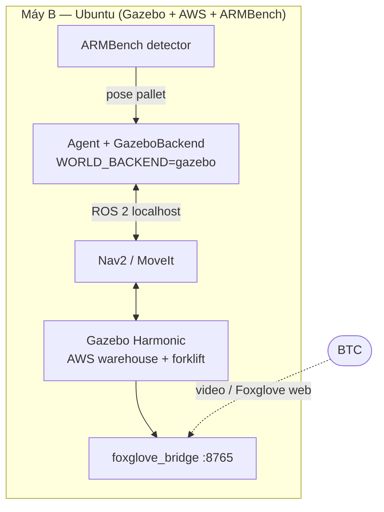

# Kế hoạch — MÁY B: Gazebo + AWS world + ARMBench (sim→real)

> **Phần của Hybrid demo.** File đôi: xem **`PLAN_may_A_web2d.md`** cho Máy A.
> **Máy B = PC Linux riêng.** Vai trò: nơi **DUY NHẤT** chạy phần nặng (Gazebo, AWS, ARMBench, ROS 2).
> **🔌 Sensor robot:** chốt *agent cần thêm sensor gì* (odom/LiDAR/camera/depth/IMU + fallback) tách riêng ở **`PLAN_may_B_sensors.md`** — checklist + bảng báo cáo cho Claude Code.

---

## 0. Quy trình phối hợp 2 máy (ghi chú vận hành)

- **Máy A (Windows, chat Cowork) và Máy B (Linux) chạy ĐỘC LẬP** — không nối DDS/mạng; đồng bộ duy nhất qua **git** và **copy báo cáo qua chat**.
- **Giao việc:** đưa 2 file `PLAN_may_B_gazebo.md` + `PLAN_may_B_sensors.md` cho **Claude Code trên máy B** tự làm theo.
- **Báo cáo:** máy B báo **theo từng mốc, không chờ xong hết** — user copy nguyên văn sang chat máy A tại 3 thời điểm:
  1. Sau mỗi đợt verify (điền bảng §6 file sensors / checklist §10–11 file này);
  2. **Ngay khi** có mục `⚠ blocked` (để gỡ sớm, không tốn ngày);
  3. Sau eval Bảng C + parity trace 2D↔Gazebo.
- **Mọi file thay đổi trên máy B phải commit/push** — repo phía máy A không tự thấy (sdf/urdf/bridge.yaml hiện vẫn chỉ nằm trên máy B).

### Quy tắc báo cáo (bổ sung sau review 2026‑06‑10 — BẮT BUỘC)

> Bối cảnh: 4 báo cáo liên tiếp chỉ có sửa code, 0 output thật; cả 4 bug do máy A bắt bằng suy luận. Verify‑by‑reasoning không thay được verify‑by‑execution.

1. **Báo cáo không kèm raw output = không tính là báo cáo.** Mỗi claim ✅ phải dán kèm output lệnh DoD (`gz topic -l`, `ros2 topic list`, `tf2_echo`, `topic hz`…) hoặc screenshot. ◐ giữ nguyên cho tới khi có output.
2. **Thứ tự việc cho máy B (không đổi):**
   - (0) `git add → commit → push` NGAY, trước mọi việc khác;
   - (1) chạy verify sequence §6 file sensors, dán raw output, điền bảng;
   - (2) script so **pose detector vs ground‑truth** (tolerance ±0.1 m) — bắt buộc trước Bảng C;
   - (3) log đủ **cả 3 tầng fallback** (TF→manual · CameraInfo→K hardcode · detector→ground‑truth) + ghi đường active vào trace từng task;
   - (4) **CẤM thêm feature perception mới** cho tới khi P0.1 Bảng A (sprint D1) xong — Gazebo là P1.6 bonus, ground‑truth fallback được phép miễn disclosure.
3. **K hardcode khi thiếu CameraInfo:** đổi thành fail to/log rõ — không đoán im lặng (hằng số nhân đôi với SDF).

### Kênh git (BẮT BUỘC — bổ sung 2026‑06‑10)

- **Máy B push lên repo riêng:** `https://github.com/zerokhong1/AI20K-mayB` — máy A theo dõi/review qua repo này.
- **TUYỆT ĐỐI KHÔNG push công việc máy B lên git BTC** (origin của repo máy A: `AI20K-Build-Cohort-2/starter-code-template.git`). Chỉ phần thuộc bài nộp official — do phía máy A quyết — mới vào repo BTC.
- Repo mayB đang **PUBLIC**: cấm commit key/`.env`/token (kể cả trong history); cân nhắc chuyển private trước ngày nộp.
- `mayB.md` trong repo là **bản sao** — nguồn chuẩn là `PLAN_may_B_gazebo.md` phía máy A; mỗi lần plan đổi phải đồng bộ, không để 2 bản lệch (bản trên repo hiện **chưa có §0 này**).
- **Cấm dùng lại tên "Bảng A/Bảng B"** cho bất kỳ bảng nội bộ nào của repo mayB — hai tên đó thuộc eval official (Gemini, repo BTC). Bảng nội bộ đặt tên khác (vd "Bảng A′ dev").

### Quyết định F6 (chốt 2026‑06‑10): "hai máy tương tự nhau"

1. **Máy B đổi LLM → Gemini flash-lite** (cùng model với official; bỏ Claude Opus 4.8). Swap client trong `llm_agent.py` (anthropic → google-genai function-calling); **giữ nguyên tool schema**.
2. **Quota:** dùng **key Gemini RIÊNG** (tài khoản thành viên khác), không đụng key đang chạy P0.1. Nếu buộc dùng chung key → máy B chỉ được gọi LLM **sau khi** P0.1 Bảng A chốt số trong report_v2.
3. Sau swap, **chạy lại parity bằng LLM thật** (không scripted): cùng goal → trace flat2d vs gazebo → nâng claim từ "interface parity (scripted)" lên **"agent parity — cùng model, cùng tool, đổi backend"**. Dán cả 2 trace làm bằng chứng.
4. Cập nhật README/Disclosure trong cùng pass: bỏ mọi nhắc "Claude Opus 4.8"; sửa luôn 2 lỗi sót — sơ đồ `Flat2DBackend (Máy A — 2D)` → "(mayB 2D ref)", và ghi rõ parity nào scripted/LLM.
5. **Stretch (không chặn deadline):** hợp nhất code agent thật sự (port LangGraph từ repo BTC sang, hoặc port `GazeboBackend` về repo BTC) — chỉ làm sau khi F5 + Bảng C xong.

---

## ⚠️ Điểm mấu chốt

**AWS warehouse world + Gazebo + ARMBench chạy HẾT ở Máy B — không phải Máy A.**

Máy A (Windows) không chạy Gazebo được; vì vậy mọi thứ cần Gazebo/ROS/GPU đều đặt ở đây. BTC **không cần** chạy Máy B — họ chỉ xem qua **video** hoặc **Foxglove web**.

---

## 1. Phần cứng & OS

| Mục | Yêu cầu |
|---|---|
| OS | **Ubuntu 24.04 (Noble)** |
| ROS 2 | **Jazzy Jalisco** |
| Sim | **Gazebo Harmonic** (Gazebo Classic đã EOL 1/2025) |
| Nav/Manip | **Nav2** + **MoveIt** |
| GPU | Khuyến nghị (cho camera ảo + detector ARMBench). Không GPU → chạy headless + fallback ground‑truth |
| RAM | ≥ 16 GB |

---

## 2. Máy B chạy gì (đồng thời)

| Tiến trình | Vai trò |
|---|---|
| **Gazebo Harmonic** | mô phỏng vật lý 3D |
| **AWS `small_warehouse_world`** | môi trường kho (kệ, pallet, lối đi) |
| **Robot xe nâng / AMR** (URDF/SDF) | thực thể agent điều khiển |
| **Nav2 + MoveIt** | điều hướng + nâng/hạ |
| **Agent + `GazeboBackend`** (`WORLD_BACKEND=gazebo`) | **chạy ngay trên Máy B**, nói ROS 2 qua localhost |
| **ARMBench perception node** | nhận diện pallet từ camera ảo |
| **`foxglove_bridge` (:8765)** | cho BTC xem từ xa qua trình duyệt |

> **Vì sao agent chạy trên Máy B (không phải Máy A):** ROS 2/DDS ổn định nhất trên **localhost/LAN**. Để agent ở Máy B → tránh kéo DDS qua internet (chập chờn). Máy A vẫn giữ bản agent 2D riêng của nó.

---

## 3. Cài đặt từng bước

### 3.1 ROS 2 Jazzy + Gazebo Harmonic
```bash
# ROS 2 Jazzy (theo docs.ros.org) + tích hợp Gazebo
sudo apt install ros-jazzy-desktop ros-jazzy-ros-gz \
                 ros-jazzy-navigation2 ros-jazzy-nav2-bringup \
                 ros-jazzy-moveit ros-jazzy-foxglove-bridge
```

### 3.2 AWS warehouse world (nhánh ros2)
```bash
mkdir -p ~/ws/src && cd ~/ws/src
git clone -b ros2 https://github.com/aws-robotics/aws-robomaker-small-warehouse-world.git
cd ~/ws && rosdep install --from-paths src -i -y && colcon build
source install/setup.bash
ros2 launch aws_robomaker_small_warehouse_world small_warehouse.launch.py
```

### 3.3 Robot xe nâng + Nav2
- Lấy model xe nâng (Gazebo **Fuel** hoặc URDF tự dựng), spawn vào world.
- Cấu hình Nav2 (map tĩnh của warehouse hoặc SLAM Toolbox) → robot đi tới điểm chỉ định được.

### 3.4 foxglove_bridge (xem từ xa)
```bash
ros2 launch foxglove_bridge foxglove_bridge_launch.xml
# BTC mở app.foxglove.dev → Open connection → Foxglove WebSocket → ws://<máy B>:8765
```

### 3.5 ARMBench detector (perception)
- Train/fine‑tune detector pallet/thùng từ **ARMBench** (Amazon Science: 235K+ pick‑place, 190K+ vật).
- Perception node chạy detector trên ảnh **camera ảo** trong Gazebo → publish pose pallet → tool `locate_object`.
- **Fallback:** nếu detector chưa kịp → dùng **ground‑truth model pose** của Gazebo (vẫn end‑to‑end, ghi rõ disclosure).

---

## 4. `GazeboBackend` — mapping tool → ROS 2

| Tool agent | Hiện thực ROS 2 |
|---|---|
| `perceive` | đọc `/tf`, `/odom`, `/map`, camera → world_view |
| `locate_object` | **ARMBench detector** → pose pallet · *fallback:* ground‑truth pose |
| `check_path` | Nav2 `ComputePathToPose` |
| `move_to` | Nav2 action `NavigateToPose` |
| `pick` | MoveIt + fork/gripper action (nâng pallet) |
| `drop` | MoveIt hạ + nhả |
| `wait` / `ask_human` | giữ nguyên logic agent |
| `done` | giữ nguyên |
| **oracle** | đọc **ground‑truth pose** từ Gazebo (`gz` model state) — **không tin `done`** |

> `GazeboBackend` implements **cùng interface `WorldBackend`** mà Máy A đã tách ra → **không sửa lớp agent**.

---

## 5. Cách showcase cho BTC (không bắt BTC chạy gì)

1. **Video (kênh chính):** screen‑record agent điều khiển Gazebo trên Máy B, lồng tiếng. Không cần mạng.
2. **Live stream (tùy chọn):** Máy B mở `foxglove_bridge` qua **LAN phòng demo** hoặc **tunnel** (`cloudflared`/`ngrok`); BTC mở Foxglove web → thấy Nav2 path, camera, detection ARMBench.
3. **Điểm nhấn:** chạy **cùng mục tiêu** như bản 2D của Máy A → **trace giống hệt** → chứng minh *1 agent – 2 backend*.



---

## 6. Timeline phần Máy B

- **D3–4:** dựng ROS 2 Jazzy + Gazebo Harmonic + AWS world chạy được; spawn xe nâng + Nav2 đi tới điểm.
- **D5–7:** `GazeboBackend` tối thiểu (`move_to`/`pick`/`drop` qua Nav2/MoveIt) dùng **ground‑truth pose**; agent chạy **1 task end‑to‑end** trong Gazebo.
- **D8–9:** `foxglove_bridge` + dựng cảnh quay; oracle đọc ground‑truth Gazebo.
- **D10–11:** ARMBench detector (camera ảo) cho `locate_object`; giữ fallback.
- **D12–13:** quay video Gazebo; chuẩn bị tunnel cho live stream.

---

## 7. Rủi ro & dự phòng

| Rủi ro | Dự phòng |
|---|---|
| Gazebo/ROS vỡ lúc live | **Video là kênh chính**, live stream chỉ bonus |
| ARMBench detector chưa kịp/nặng | **Fallback ground‑truth pose** (ghi rõ disclosure) |
| Máy B không GPU | Gazebo headless, giảm sensor, ưu tiên fallback |
| Mạng phòng demo chập chờn | Tunnel sẵn + **video offline** |

---

## 8. Honesty / disclosure

- Gazebo là **mô phỏng**; agent (LLM + vòng tool) là **thật**, đọc kết quả thật từ ROS 2.
- Nếu dùng ground‑truth pose thay ARMBench detector → **ghi rõ** trong báo cáo eval.
- **Oracle độc lập** chấm cả Máy A (2D) lẫn Máy B (Gazebo).

---

## 9. Việc cần chốt tiếp

- **Model xe nâng:** lấy Fuel hay tự dựng URDF? Có **fork nâng pallet** (joint) hay coi như **AMR kéo** (đơn giản hơn cho deadline)?
- **GPU Máy B:** có hay không → quyết ARMBench detector thật hay fallback ground‑truth.
- **Mạng phòng thi:** cho mở tunnel/LAN không → quyết live stream hay chỉ video.

---

## 10. Checklist Máy B — giai đoạn 1: DỰNG (✅ hoàn thành 2026‑06‑10)

- [x] ROS 2 Jazzy + Gazebo Harmonic + AWS world chạy
- [x] Xe nâng spawn + Nav2 đi tới điểm
- [x] `GazeboBackend` (cùng `WorldBackend`) — agent 1 task end‑to‑end
- [x] Oracle đọc ground‑truth Gazebo
- [x] foxglove_bridge xem được từ trình duyệt
- [x] (Stretch) ARMBench detector cho `locate_object`
- [x] Video Gazebo 3 phút quay xong

---

## 11. Checklist Máy B — giai đoạn 2: NGHIỆM THU & TÍCH HỢP

> Mục tiêu: biến phần dựng xong thành **bằng chứng chấm điểm được** (eval + tài liệu) và **demo không thể vỡ**. Liên kết với `KE_HOACH_FINAL_SPRINT.md` (P0.4 video, P1.2 deck, P2 sim→real).

### 11.1 Kiểm chứng & eval trên Gazebo (biến demo thành số liệu)

- [ ] Chạy **≥3 task m\*** (cùng goal_text như bản 2D) trên `WORLD_BACKEND=gazebo`, oracle ground‑truth chấm — ghi id task, success, steps, thời gian
- [ ] Thêm **"Bảng C — Gazebo (bonus showcase)"** vào `eval/results/report_v2.md`: tách bạch khỏi Bảng A/B, ghi rõ n nhỏ, `locate_object` dùng **ARMBench detector hay ground‑truth** ở từng task
- [ ] **Parity check "1 agent – 2 backend":** cùng 1 goal → xuất 2 trace (2D vs Gazebo) → so chuỗi tool gọi; lưu 2 file trace cạnh nhau làm bằng chứng
- [ ] **Contract test `WorldBackend`** chạy được KHÔNG cần ROS (mock/skip nếu thiếu `rclpy`) → CI trên GitHub vẫn xanh dù runner không có Gazebo

### 11.2 Độ bền demo (không được vỡ trước BTC)

- [ ] **Khởi động 1 lệnh** (script/tmux/launch tổng): từ máy boot → sẵn sàng demo **<5 phút**, không thao tác tay
- [ ] Chạy bài demo **5 lần liên tiếp không fail**; ghi lại lần fail (nếu có) + cách khắc phục
- [ ] **Quy trình recovery** khi Gazebo/Nav2/bridge treo: lệnh restart từng tầng, thời gian phục hồi đo thật
- [ ] Thử chế độ **headless + fallback ground‑truth** (phòng GPU bận/hỏng ngày demo)

### 11.3 Showcase & tư liệu demo day

- [ ] Cắt **30–45s** đoạn Gazebo đắt nhất (nhận lệnh tiếng Việt → Nav2 chạy → pick/drop → oracle pass) ghép vào video 3' chung, kèm phụ đề disclosure *"mô phỏng · agent thật"*
- [ ] Clip **side‑by‑side**: Máy A (2D) và Máy B (Gazebo) chạy **cùng một lệnh** — tư liệu cho slide sim→real
- [ ] Lưu **Foxglove layout** (.json: camera + Nav2 path + detection) để mở lại 1 click; test tunnel (`cloudflared`/`ngrok`) từ mạng ngoài
- [ ] Plan B ngày demo: video offline nằm sẵn trên cả 2 máy + USB

### 11.4 Tài liệu & trung thực

- [ ] Viết **`RUN_may_B.md`** (runbook như `RUN_may_A.md`): cài đặt, khởi động 1 lệnh, kịch bản demo, recovery
- [ ] Cập nhật **README + ARCHITECTURE**: sơ đồ 2 backend + cờ `WORLD_BACKEND`; ghi rõ ranh giới — *Gazebo = bonus showcase sim→real, KHÔNG thuộc phạm vi đo Bảng A/B*
- [ ] Disclosure ARMBench: nêu rõ detector dùng ở đâu, fallback ở đâu, độ chính xác quan sát được (không khoe số chưa đo)
- [ ] **Pitch deck +1 slide sim→real**: "cùng agent, đổi backend 2D→Gazebo không sửa lớp agent" (đúng bằng chứng B3(b) trong `Dieu_chinh_du_an_AI20K162.md`)

### 11.5 Demo day

- [ ] Dry‑run chuyển cảnh: live 2D (Máy A) → video/stream Gazebo (Máy B) đúng timing kịch bản 3'
- [ ] Thuộc câu trả lời Q&A: *"Đây có phải robot thật?"* → "Gazebo là mô phỏng vật lý 3D; agent thật; đường sim→real đi qua cùng interface `WorldBackend` — bằng chứng là 2D và Gazebo chạy cùng code agent"
