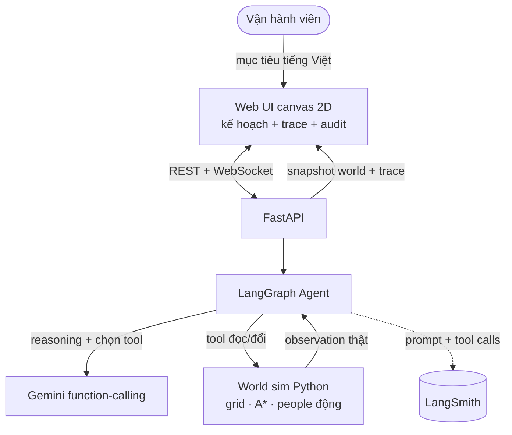
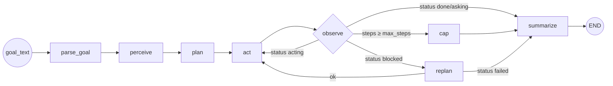

# SPEC — Kỹ thuật AI20K‑162 "RoboPlanner"

| | |
|---|---|
| **Phiên bản** | 1.0 |
| **Ngày** | 2026‑06‑06 |
| **Phạm vi** | Đặc tả kỹ thuật khớp mã nguồn `src/` (Phase 0–7) + bổ sung **v2 thu nhỏ** |
| **Tài liệu liên quan** | [`PLAN_thu_nho_162.md`](PLAN_thu_nho_162.md) · [`PRD.md`](PRD.md) · [`ARCHITECTURE.md`](ARCHITECTURE.md) · v2: [`eval/results/report_v2.md`](eval/results/report_v2.md) |

> Tài liệu này mô tả **đúng những gì code làm**. Mọi tên node/tool/field/endpoint đều trích từ `src/`.

> ⚠️ **Bổ sung v2 (thu nhỏ).** Sim được khóa bằng **bất biến** (`invariants.assert_invariants`, gọi sau mỗi mutation qua `World._verify`) và **oracle** (`oracle.check_object_moved`) để chấm eval độc lập. Agent graph thêm cờ **`core_scope`** (config) — bật thì bỏ nhánh replan (logic ở `agents/routing.py`). Eval v2: `eval/gen_move_tasks.py` + `eval/run_eval_v2.py` → `eval/results/report_v2.md` (Bảng A agent / Bảng B xác định, tách bạch). Xem [`PLAN_thu_nho_162.md`](PLAN_thu_nho_162.md).

---

## 1. Tổng quan kiến trúc

Agent **LangGraph** (plan‑and‑execute + ReAct) nhận mục tiêu tiếng Việt, gọi **Gemini** (function‑calling) để suy luận và chọn tool, thao tác lên một **World sim 2D** đặt ở backend (Python — "có thẩm quyền"), rồi stream trace + trạng thái qua **WebSocket** cho frontend canvas render. Tool **đọc/ghi trạng thái thật** của World ⇒ chống hallucinate.

**Tech stack:** FastAPI + Python 3.11 · LangGraph + LangChain · langchain‑google‑genai (Gemini) · Pydantic v2 / pydantic‑settings · WebSocket · frontend canvas 2D thuần (HTML/CSS/JS) · Docker + GitHub Actions + LangSmith.

---

## 2. Thành phần

| Thành phần | Vị trí | Vai trò |
|---|---|---|
| Frontend showcase | `frontend/` | Canvas 2D, panel kế hoạch/trace, replay, audit, voice |
| API layer | `src/api/routes.py`, `src/main.py` | REST + WebSocket; mount frontend tĩnh tại `/` |
| Agent | `src/agents/graph.py`, `src/agents/nodes/`, `src/agents/state.py` | Vòng lặp LangGraph |
| Tools | `src/agents/tools/tools.py` | 9 tool thao tác World |
| LLM service | `src/services/llm.py` | `ChatGoogleGenerativeAI` (Gemini) |
| World sim | `src/services/world.py` | Grid, A*, mutations + tự kiểm bất biến (`_verify`) |
| Bất biến sim (v2) | `src/services/invariants.py` | `assert_invariants` (S1–S6) — guard ở test/eval/runtime |
| Oracle (v2) | `src/services/oracle.py` | `check_object_moved` — chấm điểm độc lập |
| Routing (v2) | `src/agents/routing.py` | `decide_observe_route` + cờ `core_scope` |
| Schemas | `src/models/schemas.py` | Pydantic models |
| Config | `src/config.py` | `Settings` (pydantic‑settings) |
| Eval | `eval/` | Bộ task, harness, report |

---

## 3. Mô hình dữ liệu (`src/models/schemas.py`)

| Model | Trường | Ghi chú |
|---|---|---|
| `Cell` | `x:int, y:int` | Toạ độ ô lưới |
| `Entity` | `id:str, kind:{robot,object,person,obstacle}, label:str?, pos:Cell, carrying:str?` | Thực thể trong World |
| `Zone` | `name:str, cells:list[Cell]` | Khu vực (khu A, chuyền 3…) |
| `WorldState` | `width, height, robot:Entity, objects[], people[], obstacles[], zones[], tick:int, task:dict?` | Trạng thái world đầy đủ |
| `RunRequest` | `goal_text:str` | Input chạy agent |
| `RunResponse` | `plan:list[str], history:list[dict], answer:str, status:str` | Output chạy agent |

Vật đang được mang được đánh dấu bằng `pos = (-1, -1)` (off‑grid).

---

## 4. Agent (LangGraph) — `src/agents/graph.py`

### 4.1 State (`AgentState`, TypedDict total=False)
`goal_text · goal · plan · history · world_view · status · replans · steps · answer · pending_question`

### 4.2 Nodes
`parse_goal · perceive · plan · act · observe · replan · cap · summarize`
(`ask_human` và `wait` là **tool**, không phải node; hành vi "dừng & hỏi" thể hiện qua `status="asking"`.)

### 4.3 Luồng & điều kiện rẽ nhánh

Quy tắc routing (khớp code):

- **`_route_observe`**: `steps ≥ max_steps` → `cap`; `status ∈ {done, asking}` → `summarize`; `status == blocked` → `replan`; còn lại → `act`.
- **`_route_replan`**: `status == failed` → `summarize`; còn lại → `act`.
- **`_cap_node`**: đặt `status=failed`, `answer="Vượt giới hạn … bước"`, rồi vào `summarize`.

### 4.4 Cap an toàn (từ `Settings`)
`max_steps = 40`, `max_replans = 5` → chống vòng lặp vô hạn; `llm_temperature = 0.2`.

---

## 5. Bộ công cụ (9 tool) — `src/agents/tools/tools.py`

Mọi tool đọc/ghi **World singleton thật** và trả **JSON string** (`ensure_ascii=False`).

| Tool | Chữ ký | Trả về |
|---|---|---|
| `perceive` | `()` | robot(pos,carrying), objects/people/obstacles/zones, tick |
| `locate_object` | `(label:str)` | found, id, pos, zone, relative (trái/phải, gần/xa) — khớp fuzzy (bỏ dấu, hoa/thường) |
| `check_path` | `(target_x:int, target_y:int)` | clear:bool; nếu nghẽn: blocker (người) hoặc reason="no_path" |
| `move_to` | `(target_x, target_y)` | reached:bool, pos; **dừng nếu ô kế có người** → blocked_by |
| `pick` | `(object_id_or_label:str)` | ok, carrying / error (already_carrying, not_adjacent, object_not_found) |
| `drop` | `(target_x, target_y)` | ok, dropped, at / error (not_carrying) |
| `wait` | `(ticks:int=1)` | advance tick + perceive lại (người có thể đã di chuyển) |
| `ask_human` | `(question:str)` | paused=True, question — agent dừng chờ trả lời |
| `done` | `(summary:str)` | done=True, summary |

`ALL_TOOLS` được bind vào Gemini qua function‑calling.

---

## 6. World engine — `src/services/world.py`

- **Lưới 2D** (vd 16×10); thực thể: robot, objects (có nhãn), people (động), obstacles (tĩnh), zones.
- **Pathfinding A\*** hai biến thể: `astar` (tránh obstacle **+ người**) và `astar_static` (chỉ tránh obstacle tĩnh). Heuristic Manhattan, 4‑hướng.
- **`move_robot_to`**: đi từng ô theo `astar_static`; **dừng ngay nếu ô kế tiếp có người** → trả `blocked_by` (kích hoạt replan). Đây là quyết định thiết kế để vòng dừng/hỏi/replan được kích hoạt đúng (không để A* "lặng lẽ" vòng tránh).
- **`pick_object`**: chỉ nhặt khi khoảng cách Manhattan ≤ 1; đánh dấu vật `pos=(-1,-1)`.
- **`drop_at`**: đặt vật đang mang xuống ô đích.
- **`advance_tick`**: đẩy tick; áp **sự kiện động** từ `task.dynamic` (người di chuyển tới ô mới theo mốc tick).
- **Khớp tên** (`_normalize`): NFC + casefold + strip → hỗ trợ tiếng Việt có dấu.
- **Singleton**: `get_current_world()` / `set_current_world()`; mặc định nạp `eval/scenarios/warehouse_basic.json`.

---

## 7. API — `src/api/routes.py` (prefix `/api/v1`) + `src/main.py`

| Method | Path | Mô tả |
|---|---|---|
| GET | `/health` | `{"ok": true}` |
| GET | `/api/v1/world` | Trả `WorldState` hiện tại |
| POST | `/api/v1/scenario?name=<tên>` | Nạp kịch bản từ `eval/scenarios/<tên>.json` → set world; 404 nếu không có |
| POST | `/api/v1/run` | `{goal_text}` → chạy agent end‑to‑end → `RunResponse` (plan, history, answer, status) |
| WS | `/api/v1/ws` | Stream từng bước agent |

`src/main.py` mount `frontend/` tĩnh tại `/` (`html=True`) **sau** các route API ⇒ một origin phục vụ cả UI lẫn API (frontend dùng path tương đối).

### 7.1 Giao thức WebSocket
- **Client → Server (1 lần):** `{"goal_text": "..."}`.
- **Server → Client (stream theo node):**
  `{"type":"step", "node", "last_action"?, "world_view"?, "status"?, "plan"?, "answer"?, "pending_question"?, "world": <snapshot>}`
  trong đó `world` là snapshot gọn (`to_snapshot()`: robot pos/carrying, people pos, tick) để animate.
- **Kết thúc:** `{"type":"done"}`. **Lỗi parse:** `{"type":"error","detail":...}`.

---

## 8. Frontend (`frontend/`)

`index.html` + `app.js` + `style.css` + `replays/*.json`. Canvas vẽ lưới/zone/obstacle/object/people/robot từ snapshot. Hai chế độ: **Chạy thật** (mở WS `/api/v1/ws`, stream trace) và **Phát lại** (đọc `replays/<key>.json`, không gọi API). Tính năng: chip 1‑chạm (set goal+scenario+replay rồi chạy), bảng **Kế hoạch** (đánh dấu active/done), **Trace** (node→action(args)→observation→✓/✗, badge "100% bám thực tế"), **⤓ Xuất audit log** (JSON), panel **Hỏi người** (`status=asking`), panel **Chỉ số**, xử lý **429/quota** (gợi ý Demo nhanh), nhập **giọng nói** vi‑VN (Web Speech API), responsive + dark.

> Phục vụ tĩnh: phải qua server (cách 1: backend tại `:8000`; cách 2: `python -m http.server` trong `frontend/`) vì dùng path tương đối — xem `run.bat`/`demo.bat`.

---

## 9. Cấu hình & Secrets — `src/config.py`

`Settings` (pydantic‑settings, đọc `.env`, `extra="ignore"`):

| Nhóm | Khoá | Mặc định |
|---|---|---|
| App | `app_name, app_env, app_port, app_host, log_level, cors_origins` | 8000 / 0.0.0.0 / INFO |
| LLM | `gemini_api_key`, `model_name`, `llm_temperature` | `gemini-2.0-flash`*, 0.2 |
| Cap | `max_steps`, `max_replans` | 40 / 5 |
| Logs | `langchain_api_key`, `langchain_project`, `langchain_tracing_v2` | `ai20k-162-agent` / false |

\* `model_name` là mặc định trong code, **override qua `.env`**; các lần eval đã chạy trên biến thể `flash`/`flash‑lite` tuỳ quota. `GEMINI_API_KEY` chỉ ở `.env` (gitignored).

---

## 10. Eval harness (`eval/`)

- **Bộ task:** 19 file JSON `t01…t19` (`eval/scenarios/`) trải 8 nhóm: basic, obstacle, pick/drop, language, replan, safety, infeasible, robustness; + 3 world mẫu (`warehouse_basic/blocked/dynamic`).
- **Scripts:** `run_eval.py` (chạy + tính metric), `run_multiseed.py` (đa seed, checkpoint), `generate_report.py` (xuất `report.md`); **v2:** `gen_move_tasks.py` (sinh `m*.json`), `run_eval_v2.py` (oracle + 2 lớp tách bạch → `report_v2.md`).
- **Metric:** `success_rate`, `latency_per_step`, `replan_count`, `safety_violations`, `safety_events_handled`, `avg_steps`, `invalid_tool_calls`, `infeasible_correct`.
- **Hai bảng tách bạch:** **A** = agent Gemini thật (**n=8**, 1 seed; quota free‑tier); **B** = mock A* xác định (19 task, kiểm môi trường — **không phải agent**).
- **Số liệu v1 (nguồn: `report.md`):** core (7 task lõi) **100%±0%**; tổng **87.5%** (n=8); latency **4.44s±2.66s** (⚠️ chưa đạt <3s); `invalid_tool_calls 0%`; `safety_events_handled=3`; ablation replan **12/19→19/19 trên harness A\* xác định (chưa chạy trên LLM agent)**.
- **Số liệu v2 (nguồn: `report_v2.md`, move‑one‑object):** Bảng B (solver xác định) **9/9 task feasible**, **infeasible_correct 2/2**; Bảng A (agent thật) chấm bằng **oracle**, báo **mean ± std + n** — chạy `run_eval_v2.py --seeds 3` khi có `GEMINI_API_KEY` (chưa có thì để trống, không bịa số).

---

## 11. DevOps, CI, logging

- **CI** (`.github/workflows/ci.yml`): `ruff` + `pytest` + `docker build` mỗi push/PR → badge xanh trên README.
- **Container:** `Dockerfile` (python 3.11‑slim) + `docker-compose.yml`; `HEALTHCHECK` gọi `/health`.
- **AI logs:** LangSmith qua `LANGCHAIN_TRACING_V2` (log prompt + tool calls).
- **Lint/format:** `ruff` (chặn bare‑except `E722`); type hints toàn bộ.

---

## 12. Testing

`pytest` cho `world` / `tools` / `graph` / `eval` / **`agents` (routing)**. Bộ test mở rộng ở **v2**: **bất biến trạng thái** (S2 — `test_invariants`), **tính xác định** (S1 — hash state‑trace), **property‑based** (Hypothesis), **A\* edge cases** (S3), **pick/drop mọi nhánh + observation = sự thật** (S4/S5), **routing `core_scope`**. Chạy: `pytest -q` hoặc `make test`.

---

## 13. Bảo mật

- Secrets qua `.env` (gitignored); `.env.example` chỉ là template.
- Tool **chỉ thao tác World nội bộ**, không gọi hệ thống ngoài ⇒ an toàn để demo.
- Input validate bằng Pydantic; cap bước/replan chống lạm dụng tài nguyên.
- CORS mở cho demo; production cần siết origin + rate‑limit + auth WS.

---

## 14. Hiệu năng (trung thực)

Latency thực **~4.44s ± 2.66s/bước** (có task tới 9.38s) — do `flash‑lite` free‑tier + mạng + gọi LLM mỗi bước; **chưa đạt** mục tiêu `<3s`. Đây là **planner mức nhiệm vụ**, không phải vòng điều khiển realtime. Hướng tối ưu (chưa đo): tách "vòng lập kế hoạch" (gọi LLM) khỏi "vòng điều khiển" (không LLM), cache plan, chỉ gọi LLM khi cần replan, model nhanh hơn.

---

## 15. Triển khai

- **Local:** `run.bat`/`run.sh` (tự tạo venv + cài deps + chạy uvicorn + mở `http://localhost:8000`); hoặc `make run`; bản chỉ‑replay: `demo.bat`/`make demo`.
- **Container:** `docker compose up` → cổng 8000.
- **Cloud:** Render/Railway (Docker) theo `DEPLOY.md` / `DEPLOY_runbook.md`; cấu hình `render.yaml`.

---

## 16. Hướng phát triển (sim → real)

Nối `move_to`/`pick`/`drop` vào **ROS** (điều khiển robot thật) và thay `perceive` bằng **perception camera** (tái dùng OWL‑ViT/CV cũ làm tool tri giác → sinh world‑state từ ảnh thật). Bổ sung RAG "thư viện kỹ năng/quy trình", điều phối đa robot, và **fusion với lớp an toàn cứng** (LiDAR + cảm biến chứng nhận). Lưu ý: lớp an toàn vật lý là **bắt buộc** ở bản thật — agent vẫn chỉ là lớp ngữ nghĩa bổ trợ + human‑in‑loop.
