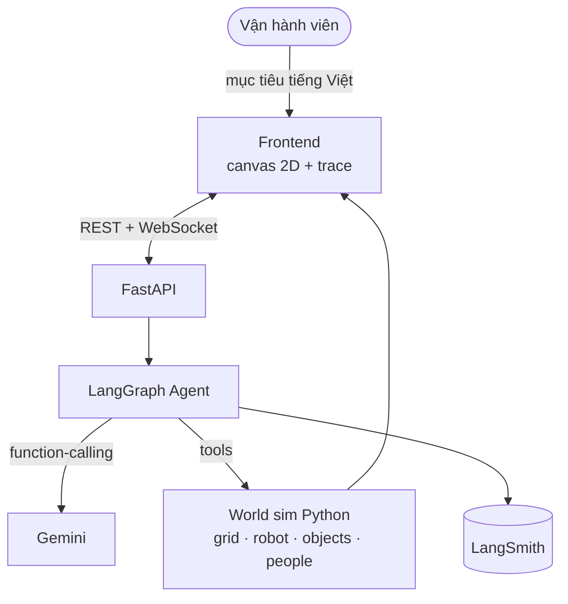
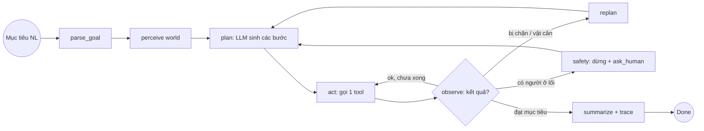
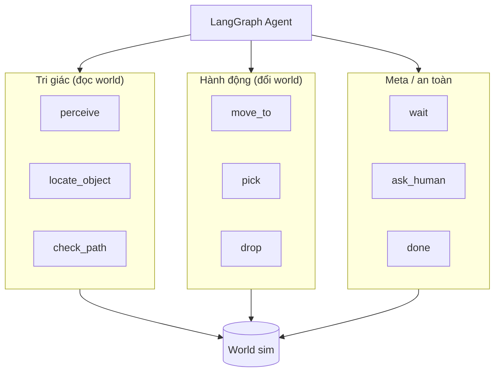

# Architecture Diagram — AI20K‑162 Task‑Planner Agent

## System Overview

## Agent Flow (vòng lập kế hoạch)

## Component Details

| Component | Technology | Purpose |
|-----------|-----------|---------|
| Frontend | Canvas 2D (JS) | Nhập mục tiêu, render sim + robot + người, hiển thị kế hoạch/trace |
| Backend | FastAPI | API + WebSocket stream |
| Agent | LangGraph + LangChain | Plan‑and‑execute + ReAct, vòng replan |
| LLM | Gemini (function‑calling) | Sinh kế hoạch + chọn tool |
| Sim World | Python `World` (grid, A*) | Môi trường có thẩm quyền; tool đọc/đổi trạng thái |
| Tools | perceive/locate/check_path/move/pick/drop/wait/ask/done | Primitives tri giác + hành động |
| Logging | LangSmith | Log prompt + tool calls (AI logs) |
| Tests | pytest | Tools, world, graph, eval |

## Tool layer (primitives của agent)

> Ghi chú trung thực: thế giới là **mô phỏng 2D** (không phải robot thật); **agent là thật** — LLM lập kế hoạch + gọi tool + đọc observation thật từ sim (không tự "tưởng tượng" kết quả). Đây là planner mức nhiệm vụ, chưa thay lớp điều khiển/an toàn cứng của robot thật.
